# dispatchCore — Complete System Design

> A real-time, multi-tenant last-mile logistics platform with an integrated gig-driver marketplace.

---

## Table of Contents
1. [Requirements & Scope](#1-requirements--scope)
2. [High-Level Design (HLD)](#2-high-level-design-hld)
3. [Database Design](#3-database-design)
4. [Low-Level Design (LLD)](#4-low-level-design-lld)
5. [UML Diagrams](#5-uml-diagrams)
6. [API Design](#6-api-design)
7. [Scalability, Performance & Security](#7-scalability-performance--security)
8. [Deployment & Maintenance](#8-deployment--maintenance)

---

## 1. Requirements & Scope

### 1.1 Problem Statement
Last-mile delivery is the most expensive segment of the logistics chain. Small and mid-sized courier companies lack real-time coordination tools, leading to double-assignments, idle drivers, zero customer visibility, and wasted fuel. dispatchCore solves this by providing a centralized, real-time dispatch control platform.

### 1.2 Functional Requirements

#### SuperAdmin
| ID | Requirement | Status |
|---|---|---|
| FR-SA-01 | View platform-wide KPIs (total companies, drivers, orders, deliveries) | ✅ Implemented |
| FR-SA-02 | Manage all companies on the platform | ✅ Implemented |
| FR-SA-03 | View and manage all drivers across the platform | ✅ Implemented |
| FR-SA-04 | View and manage all orders across the platform | ✅ Implemented |
| FR-SA-05 | Manage persistent superadmin settings/preferences | ✅ Implemented |
| FR-SA-06 | View platform-wide analytics | ✅ Implemented |

#### Dispatcher
| ID | Requirement | Status |
|---|---|---|
| FR-D-01 | Create new delivery orders with pickup/dropoff coordinates | ✅ Implemented |
| FR-D-02 | Assign orders directly to employed drivers (with concurrency safety) | ✅ Implemented |
| FR-D-03 | List orders on the public marketplace with a listed price | ✅ Implemented |
| FR-D-04 | View and accept/reject bids from independent drivers | ✅ Implemented |
| FR-D-05 | View live map showing all employed drivers and active independent drivers | ✅ Implemented |
| FR-D-06 | View real-time order status updates | ✅ Implemented |
| FR-D-07 | View route-matched independent drivers near an order's path | ✅ Implemented |
| FR-D-08 | View full delivery history (all fields: customer, pricing, events, driver info) | ✅ Implemented |
| FR-D-09 | In-app messaging with drivers and recipients (per-order channels) | ✅ Implemented |
| FR-D-10 | View dispatcher-specific analytics dashboard | ✅ Implemented |
| FR-D-11 | Manage company drivers (create, view profiles) | ✅ Implemented |
| FR-D-12 | View active driver routes on the map | ✅ Implemented |

#### Employed Driver
| ID | Requirement | Status |
|---|---|---|
| FR-ED-01 | Receive assigned deliveries in real-time | ✅ Implemented |
| FR-ED-02 | Update delivery status (ASSIGNED → PICKED_UP → EN_ROUTE → DELIVERED) | ✅ Implemented |
| FR-ED-03 | Stream GPS location continuously while online | ✅ Implemented |
| FR-ED-04 | View assigned delivery queue and active deliveries | ✅ Implemented |
| FR-ED-05 | View own delivery history (limited fields) | ✅ Implemented |
| FR-ED-06 | In-app messaging with dispatcher and recipient | ✅ Implemented |
| FR-ED-07 | View shift schedule | ✅ Implemented |
| FR-ED-08 | Dashboard with stats, shift progress, and company info | ✅ Implemented |
| FR-ED-09 | Auto-refresh dashboard every 30s to sync with dispatcher changes | ✅ Implemented |

#### Independent Driver
| ID | Requirement | Status |
|---|---|---|
| FR-ID-01 | Register as independent driver (signup flow) | ✅ Implemented |
| FR-ID-02 | Browse marketplace listings from all companies | ✅ Implemented |
| FR-ID-03 | Place counter-offer bids on listed orders | ✅ Implemented |
| FR-ID-04 | Pre-register travel routes (start, destination, departure time) | ✅ Implemented |
| FR-ID-05 | Stream GPS during active delivery via geolocation hook | ✅ Implemented |
| FR-ID-06 | Update delivery status once a bid is accepted | ✅ Implemented |
| FR-ID-07 | View own delivery history with earnings | ✅ Implemented |
| FR-ID-08 | In-app messaging with dispatcher and recipient | ✅ Implemented |
| FR-ID-09 | View earnings dashboard (today, weekly, chart) computed from history | ✅ Implemented |
| FR-ID-10 | View and manage own bids | ✅ Implemented |

#### Customer
| ID | Requirement | Status |
|---|---|---|
| FR-C-01 | Track delivery live via public link (no login required) | ✅ Implemented |
| FR-C-02 | View order status timeline | ✅ Implemented |
| FR-C-03 | See a live map pin of the driver's current location | ✅ Implemented |

### 1.3 Non-Functional Requirements

| Category | Requirement | Target |
|---|---|---|
| **Latency** | GPS location updates | < 500ms end-to-end |
| **Latency** | Bid notifications to dispatcher | < 300ms |
| **Availability** | System uptime | 99.9% |
| **Concurrency** | Simultaneous order assignments | Zero double-assignments (ACID guarantee) |
| **Scalability** | Concurrent WebSocket connections | 10,000+ per server |
| **Scalability** | GPS pings per second | 1,000+ writes/sec |
| **Security** | Data isolation | Strict tenant boundary (company_id scoping) |
| **Security** | Authentication | JWT (HttpOnly cookie primary) with bearer-token fallback for strict browser environments |

### 1.4 MoSCoW Prioritization

| Priority | Features |
|---|---|
| **Must Have** | Multi-tenant isolation, Order CRUD, Direct assignment with locking, Live GPS tracking, WebSocket rooms, Marketplace listing, Bidding, Customer tracking page, Delivery history (role-scoped), In-app messaging |
| **Should Have** | Route pre-registration, Route matching, Delivery event audit log, Earnings computation, Auto-refresh dashboards, Server-side status transition enforcement |
| **Won't Have (CE-01)** | Push notifications, AI route optimization, Email notifications, CI/CD, WebSocket auth handshakes, Hub management UI, RouteStop multi-delivery batching, Per-user rate limiting |

---

## 2. High-Level Design (HLD)

### 2.1 System Architecture

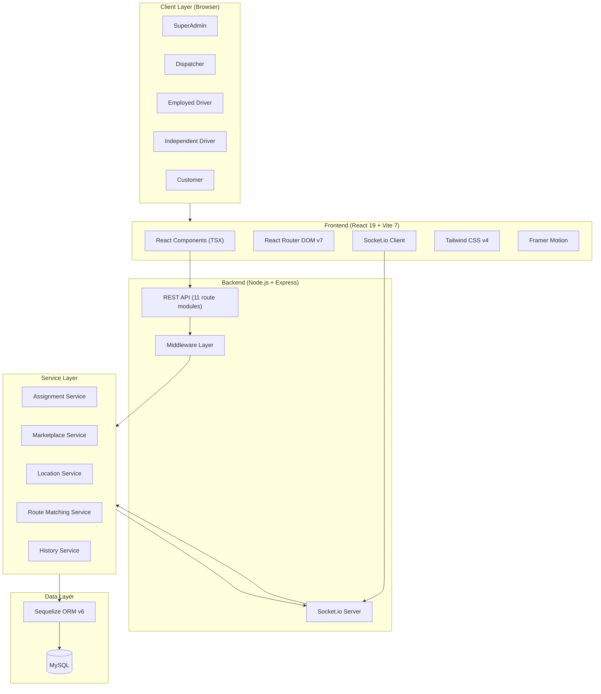
```mermaid
graph TB
    subgraph Clients["Client Layer (Browser)"]
        SA["SuperAdmin"]
        DD["Dispatcher"]
        ED["Employed Driver"]
        ID["Independent Driver"]
        CT["Customer"]
    end

    subgraph Frontend["Frontend (React 19 + Vite 7)"]
        RC["React Components (TSX)"]
        RR["React Router DOM v7"]
        SC["Socket.io Client"]
        TW["Tailwind CSS v4"]
        FM["Framer Motion"]
    end

    subgraph Backend["Backend (Node.js + Express)"]
        REST["REST API (11 route modules)"]
        WS["Socket.io Server"]
        MW["Middleware Layer"]
    end

    subgraph Services["Service Layer"]
        AS["Assignment Service"]
        MS["Marketplace Service"]
        LS["Location Service"]
        RMS["Route Matching Service"]
        HS["History Service"]
    end

    subgraph Data["Data Layer"]
        ORM["Sequelize ORM v6"]
        DB[("MySQL")]
    end

    Clients --> Frontend
    RC --> REST
    SC --> WS
    REST --> MW --> Services
    WS --> Services
    Services --> ORM --> DB
    Services --> WS
```

### 2.2 Data Flow Diagram (Level 0 - Context)

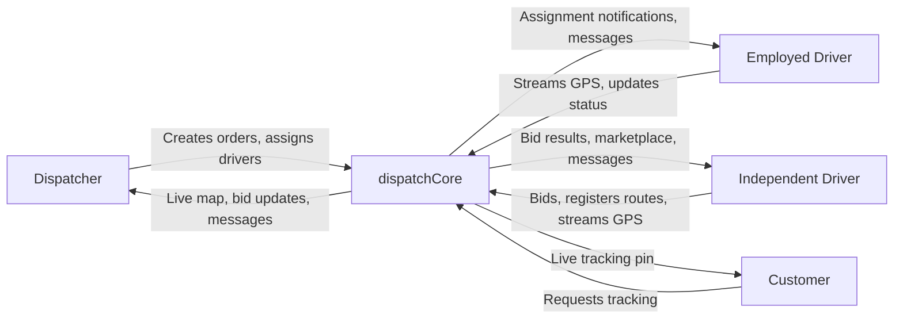
```mermaid
graph LR
    D["Dispatcher"] -->|"Creates orders, assigns drivers"| DC["dispatchCore"]
    ED["Employed Driver"] -->|"Streams GPS, updates status"| DC
    ID["Independent Driver"] -->|"Bids, registers routes, streams GPS"| DC
    C["Customer"] -->|"Requests tracking"| DC
    DC -->|"Live map, bid updates, messages"| D
    DC -->|"Assignment notifications, messages"| ED
    DC -->|"Bid results, marketplace, messages"| ID
    DC -->|"Live tracking pin"| C
```

### 2.3 Component Diagram

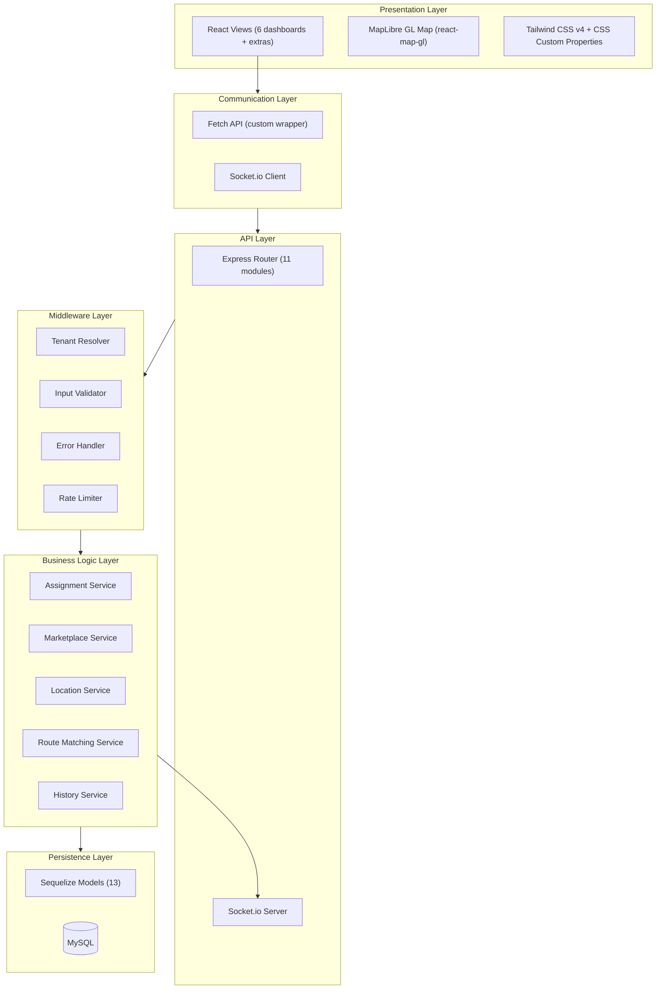
```mermaid
graph TB
    subgraph Presentation["Presentation Layer"]
        UI["React Views (6 dashboards + extras)"]
        MAP["MapLibre GL Map (react-map-gl)"]
        THEME["Tailwind CSS v4 + CSS Custom Properties"]
    end

    subgraph Communication["Communication Layer"]
        HTTP["Fetch API (custom wrapper)"]
        WSC["Socket.io Client"]
    end

    subgraph API["API Layer"]
        ROUTER["Express Router (11 modules)"]
        WSS["Socket.io Server"]
    end

    subgraph Business["Business Logic Layer"]
        ASSIGN["Assignment Service"]
        MARKET["Marketplace Service"]
        LOCATE["Location Service"]
        ROUTE["Route Matching Service"]
        HIST["History Service"]
    end

    subgraph Middleware["Middleware Layer"]
        TENANT["Tenant Resolver"]
        VALID["Input Validator"]
        ERR["Error Handler"]
        RATE["Rate Limiter"]
    end

    subgraph Persistence["Persistence Layer"]
        SEQ["Sequelize Models (13)"]
        MYSQL[("MySQL")]
    end

    UI --> Communication --> API
    API --> Middleware --> Business --> Persistence
    Business --> WSS
```

---

## 3. Database Design

### 3.1 Entity Relationship Diagram

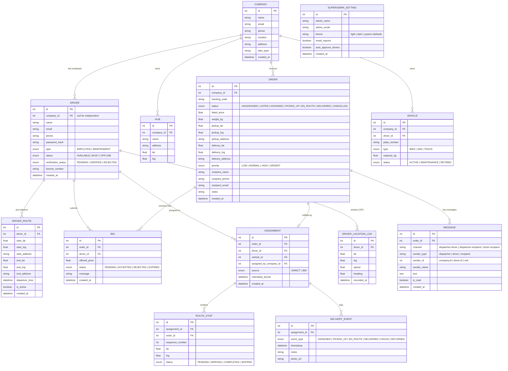
```mermaid
erDiagram
    COMPANY ||--o{ DRIVER : "has employed"
    COMPANY ||--o{ HUB : owns
    COMPANY ||--o{ ORDER : receives
    COMPANY ||--o{ VEHICLE : owns

    DRIVER ||--o{ DRIVER_ROUTE : "pre-registers"
    DRIVER ||--o{ BID : submits
    DRIVER ||--o{ ASSIGNMENT : "assigned to"
    DRIVER ||--o{ DRIVER_LOCATION_LOG : "streams GPS"

    ORDER ||--o{ BID : "receives bids"
    ORDER ||--o| ASSIGNMENT : "fulfilled by"
    ORDER ||--o{ MESSAGE : "has messages"

    ASSIGNMENT ||--o{ ROUTE_STOP : contains
    ASSIGNMENT ||--o{ DELIVERY_EVENT : logs

    COMPANY {
        int id PK
        string name
        string email
        string phone
        string location
        string address
        string plan_type
        datetime created_at
    }

    DRIVER {
        int id PK
        int company_id FK "null for independent"
        string name
        string email
        string phone
        string password_hash
        enum type "EMPLOYED | INDEPENDENT"
        enum status "AVAILABLE | BUSY | OFFLINE"
        enum verification_status "PENDING | VERIFIED | REJECTED"
        string license_number
        datetime created_at
    }

    DRIVER_ROUTE {
        int id PK
        int driver_id FK
        float start_lat
        float start_lng
        string start_address
        float end_lat
        float end_lng
        string end_address
        datetime departure_time
        boolean is_active
        datetime created_at
    }

    VEHICLE {
        int id PK
        int company_id FK
        int driver_id FK
        string plate_number
        enum type "BIKE | VAN | TRUCK"
        float capacity_kg
        enum status "ACTIVE | MAINTENANCE | RETIRED"
    }

    HUB {
        int id PK
        int company_id FK
        string name
        string address
        float lat
        float lng
    }

    ORDER {
        int id PK
        int company_id FK
        string tracking_code
        enum status "UNASSIGNED | LISTED | ASSIGNED | PICKED_UP | EN_ROUTE | DELIVERED | CANCELLED"
        float listed_price
        float weight_kg
        float pickup_lat
        float pickup_lng
        string pickup_address
        float delivery_lat
        float delivery_lng
        string delivery_address
        enum priority "LOW | NORMAL | HIGH | URGENT"
        string recipient_name
        string recipient_phone
        string recipient_email
        string notes
        datetime created_at
    }

    BID {
        int id PK
        int order_id FK
        int driver_id FK
        float offered_price
        enum status "PENDING | ACCEPTED | REJECTED | EXPIRED"
        string message
        datetime created_at
    }

    ASSIGNMENT {
        int id PK
        int order_id FK
        int driver_id FK
        int vehicle_id FK
        int assigned_by_company_id FK
        enum source "DIRECT | BID"
        datetime estimated_arrival
        datetime created_at
    }

    ROUTE_STOP {
        int id PK
        int assignment_id FK
        int order_id FK
        int sequence_number
        float lat
        float lng
        enum status "PENDING | ARRIVED | COMPLETED | SKIPPED"
    }

    DRIVER_LOCATION_LOG {
        int id PK
        int driver_id FK
        float lat
        float lng
        float speed
        float heading
        datetime recorded_at
    }

    DELIVERY_EVENT {
        int id PK
        int assignment_id FK
        enum event_type "ASSIGNED | PICKED_UP | EN_ROUTE | DELIVERED | FAILED | RETURNED"
        datetime timestamp
        string notes
        string photo_url
    }

    MESSAGE {
        int id PK
        int order_id FK
        string channel "dispatcher-driver | dispatcher-recipient | driver-recipient"
        string sender_type "dispatcher | driver | recipient"
        int sender_id "company.id | driver.id | null"
        string sender_name
        text text
        boolean is_read
        datetime created_at
    }

    SUPERADMIN_SETTING {
        int id PK
        string admin_name
        string admin_email
        string theme "light | dark | system (default)"
        boolean email_reports
        boolean auto_approve_drivers
        datetime created_at
    }
```

### 3.2 Indexing Strategy

| Table | Index | Type | Purpose |
|---|---|---|---|
| `orders` | `company_id, status` | Composite | Fast filtered queries per tenant |
| `orders` | `tracking_code` | Unique | Customer tracking lookup |
| `bids` | `order_id, status` | Composite | Fetch pending bids for an order |
| `driver_location_logs` | `driver_id, recorded_at` | Composite | Time-series GPS queries |
| `driver_routes` | `is_active, departure_time` | Composite | Active route matching |
| `assignments` | `driver_id, created_at` | Composite | Driver assignment history |
| `delivery_events` | `assignment_id` | Foreign Key | Audit trail lookup |
| `messages` | `order_id, channel` | Composite | Conversation lookup |

---

## 4. Low-Level Design (LLD)

### 4.1 Class Diagram

```mermaid
classDiagram
    class AssignmentService {
        -sequelize: Sequelize
        +assignOrder(orderId, driverId, vehicleId, companyId, options): Assignment
        -validateOrder(orderId, transaction): Order
        -validateDriver(driverId, transaction): Driver
        -createAssignmentRecord(data, transaction): Assignment
        -emitAssignmentEvent(assignment): void
    }

    class MarketplaceService {
        -sequelize: Sequelize
        +listOrder(orderId, price): Order
        +unlistOrder(orderId): Order
        +placeBid(orderId, driverId, offeredPrice, message): Bid
        +acceptBid(bidId): Assignment
        +rejectBid(bidId): Bid
        -rejectRemainingBids(orderId, acceptedBidId, transaction): void
        -convertBidToAssignment(bid, transaction): Assignment
        -emitBidEvent(bid, eventType): void
    }

    class LocationService {
        -io: SocketServer
        -broadcastContextCache: Map~driverId, CachedContext~
        +recordPing(driverId, lat, lng, speed, heading): LocationLog
        +getLatestLocation(driverId): LocationLog
        +getDriverLocations(companyId): LocationLog[]
        +broadcastLocation(driverId, location): void
        -_getBroadcastContext(driverId): Driver|null
        -_getTargetRooms(context): string[]
    }

    class RouteMatchingService {
        +registerRoute(driverId, startLat, startLng, endLat, endLng, departureTime): DriverRoute
        +deactivateRoute(routeId): void
        +findDriversNearPath(pickupLat, pickupLng, deliveryLat, deliveryLng, radiusKm): Driver[]
        +getMyRoutes(driverId): DriverRoute[]
        +getActiveRoutes(): DriverRoute[]
        -calculateDistance(lat1, lng1, lat2, lng2): float
        -isAlongRoute(route, targetLat, targetLng, radiusKm): boolean
    }

    class HistoryService {
        +getDispatcherHistory(companyId, filters): Records
        +getDriverHistory(driverId, driverType, filters): Records
        +getDeliveryDetail(assignmentId, role, driverId): Record
        -_buildQuery(filters): QueryParams
    }

    class SocketHandler {
        +initializeSocket(io): void
        +handleConnection(socket): void
        -joinCompany(companyId): void
        -joinMarketplace(companyId): void
        -joinDriver(driverId): void
        -joinTracking(orderId): void
        -joinMessages(orderId, channel): void
        -handleLocationPing(data): void
    }

    AssignmentService --> SocketHandler : emits events
    MarketplaceService --> SocketHandler : emits events
    LocationService --> SocketHandler : broadcasts GPS
```

### 4.2 Error Handling Strategy

| Error Type | HTTP Code | Handling |
|---|---|---|
| Validation Error | 400 | Return field-specific error messages |
| Tenant Access Denied | 403 | Log attempt, return generic "Forbidden" |
| Resource Not Found | 404 | Return entity type and ID |
| Concurrency Conflict | 409 | Return "Order already assigned" message |
| Lock Timeout | 408 | Retry once, then return "Try again" |
| Internal Server Error | 500 | Log full stack trace, return generic message |

---

## 5. UML Diagrams

### 5.1 Use Case Diagram

```mermaid
graph TB
    subgraph System["dispatchCore System"]
        UC1["Create Order"]
        UC2["Assign to Employed Driver"]
        UC3["List on Marketplace"]
        UC4["Place Bid"]
        UC5["Accept/Reject Bid"]
        UC6["Update Delivery Status"]
        UC7["Stream GPS Location"]
        UC8["Track Delivery Live"]
        UC9["Register Travel Route"]
        UC10["View Live Map"]
        UC11["Manage Companies"]
        UC12["View Analytics"]
        UC13["View Delivery History"]
        UC14["In-App Messaging"]
        UC15["Manage Drivers"]
        UC16["View Earnings"]
    end

    SuperAdmin(("SuperAdmin"))
    Dispatcher(("Dispatcher"))
    EmployedDriver(("Employed Driver"))
    IndependentDriver(("Independent Driver"))
    Customer(("Customer"))

    SuperAdmin --> UC11
    SuperAdmin --> UC12
    Dispatcher --> UC1
    Dispatcher --> UC2
    Dispatcher --> UC3
    Dispatcher --> UC5
    Dispatcher --> UC10
    Dispatcher --> UC12
    Dispatcher --> UC13
    Dispatcher --> UC14
    Dispatcher --> UC15
    EmployedDriver --> UC6
    EmployedDriver --> UC7
    EmployedDriver --> UC13
    EmployedDriver --> UC14
    IndependentDriver --> UC4
    IndependentDriver --> UC6
    IndependentDriver --> UC7
    IndependentDriver --> UC9
    IndependentDriver --> UC13
    IndependentDriver --> UC14
    IndependentDriver --> UC16
    Customer --> UC8
```

### 5.2 Sequence Diagram — Direct Assignment

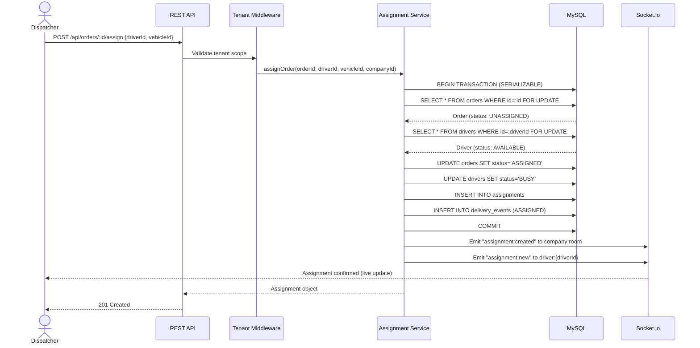
```mermaid
sequenceDiagram
    actor D as Dispatcher
    participant API as REST API
    participant MW as Tenant Middleware
    participant AS as Assignment Service
    participant DB as MySQL
    participant WS as Socket.io

    D->>API: POST /api/orders/:id/assign {driverId, vehicleId}
    API->>MW: Validate tenant scope
    MW->>AS: assignOrder(orderId, driverId, vehicleId, companyId)
    AS->>DB: BEGIN TRANSACTION (SERIALIZABLE)
    AS->>DB: SELECT * FROM orders WHERE id=:id FOR UPDATE
    DB-->>AS: Order (status: UNASSIGNED)
    AS->>DB: SELECT * FROM drivers WHERE id=:driverId FOR UPDATE
    DB-->>AS: Driver (status: AVAILABLE)
    AS->>DB: UPDATE orders SET status='ASSIGNED'
    AS->>DB: UPDATE drivers SET status='BUSY'
    AS->>DB: INSERT INTO assignments
    AS->>DB: INSERT INTO delivery_events (ASSIGNED)
    AS->>DB: COMMIT
    AS->>WS: Emit "assignment:created" to company room
    AS->>WS: Emit "assignment:new" to driver:{driverId}
    WS-->>D: Assignment confirmed (live update)
    AS-->>API: Assignment object
    API-->>D: 201 Created
```

### 5.3 Sequence Diagram — Marketplace Bidding

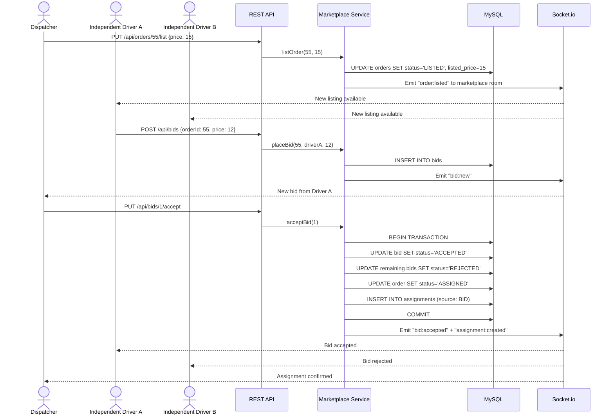
```mermaid
sequenceDiagram
    actor Disp as Dispatcher
    actor ID1 as Independent Driver A
    actor ID2 as Independent Driver B
    participant API as REST API
    participant MS as Marketplace Service
    participant DB as MySQL
    participant WS as Socket.io

    Disp->>API: PUT /api/orders/55/list {price: 15}
    API->>MS: listOrder(55, 15)
    MS->>DB: UPDATE orders SET status='LISTED', listed_price=15
    MS->>WS: Emit "order:listed" to marketplace room
    WS-->>ID1: New listing available
    WS-->>ID2: New listing available

    ID1->>API: POST /api/bids {orderId: 55, price: 12}
    API->>MS: placeBid(55, driverA, 12)
    MS->>DB: INSERT INTO bids
    MS->>WS: Emit "bid:new"
    WS-->>Disp: New bid from Driver A

    Disp->>API: PUT /api/bids/1/accept
    API->>MS: acceptBid(1)
    MS->>DB: BEGIN TRANSACTION
    MS->>DB: UPDATE bid SET status='ACCEPTED'
    MS->>DB: UPDATE remaining bids SET status='REJECTED'
    MS->>DB: UPDATE order SET status='ASSIGNED'
    MS->>DB: INSERT INTO assignments (source: BID)
    MS->>DB: COMMIT
    MS->>WS: Emit "bid:accepted" + "assignment:created"
    WS-->>ID1: Bid accepted
    WS-->>ID2: Bid rejected
    WS-->>Disp: Assignment confirmed
```

### 5.4 Sequence Diagram — GPS Location Broadcasting

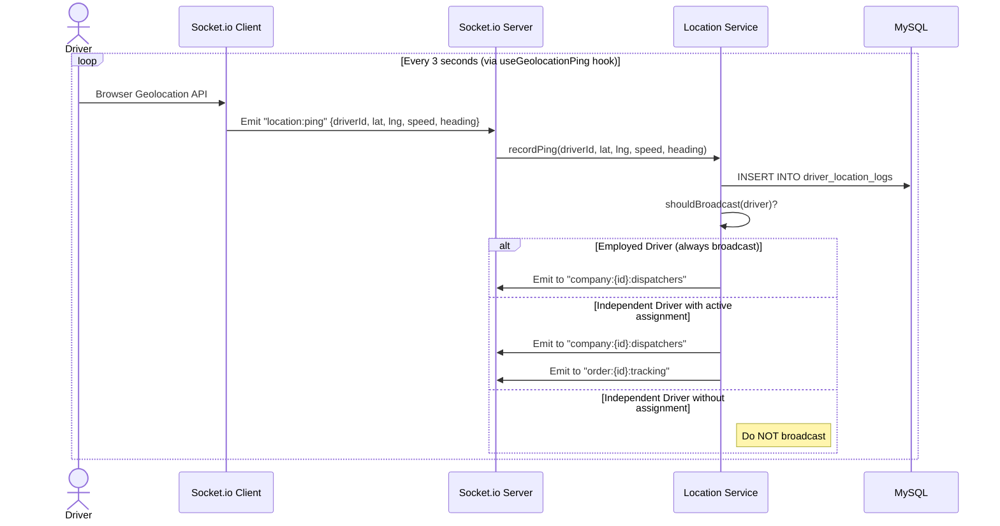
```mermaid
sequenceDiagram
    actor DR as Driver
    participant WSC as Socket.io Client
    participant WSS as Socket.io Server
    participant LS as Location Service
    participant DB as MySQL

    loop Every 3 seconds (via useGeolocationPing hook)
        DR->>WSC: Browser Geolocation API
        WSC->>WSS: Emit "location:ping" {driverId, lat, lng, speed, heading}
        WSS->>LS: recordPing(driverId, lat, lng, speed, heading)
        LS->>DB: INSERT INTO driver_location_logs
        LS->>LS: shouldBroadcast(driver)?

        alt Employed Driver (always broadcast)
            LS->>WSS: Emit to "company:{id}:dispatchers"
        else Independent Driver with active assignment
            LS->>WSS: Emit to "company:{id}:dispatchers"
            LS->>WSS: Emit to "order:{id}:tracking"
        else Independent Driver without assignment
            Note right of LS: Do NOT broadcast
        end
    end
```

### 5.5 Activity Diagram — Order Lifecycle

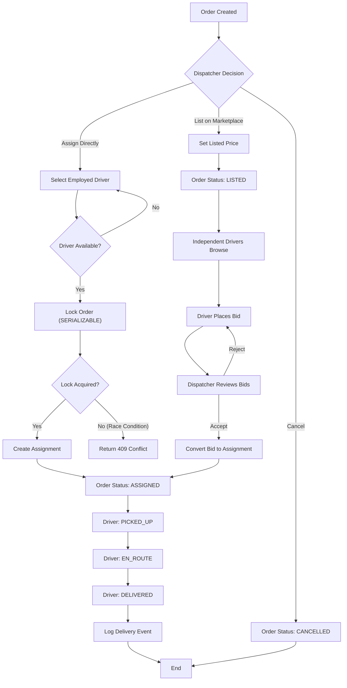
```mermaid
flowchart TD
    A["Order Created"] --> B{"Dispatcher Decision"}
    B -->|"Assign Directly"| C["Select Employed Driver"]
    B -->|"List on Marketplace"| D["Set Listed Price"]

    C --> E{"Driver Available?"}
    E -->|"Yes"| F["Lock Order (SERIALIZABLE)"]
    E -->|"No"| C

    F --> G{"Lock Acquired?"}
    G -->|"Yes"| H["Create Assignment"]
    G -->|"No (Race Condition)"| I["Return 409 Conflict"]

    D --> J["Order Status: LISTED"]
    J --> K["Independent Drivers Browse"]
    K --> L["Driver Places Bid"]
    L --> M["Dispatcher Reviews Bids"]
    M -->|"Accept"| N["Convert Bid to Assignment"]
    M -->|"Reject"| L

    H --> O["Order Status: ASSIGNED"]
    N --> O

    O --> P["Driver: PICKED_UP"]
    P --> Q["Driver: EN_ROUTE"]
    Q --> R["Driver: DELIVERED"]
    R --> S["Log Delivery Event"]
    S --> T["End"]

    B -->|"Cancel"| U["Order Status: CANCELLED"]
    U --> T
```

### 5.6 State Diagram — Order Status

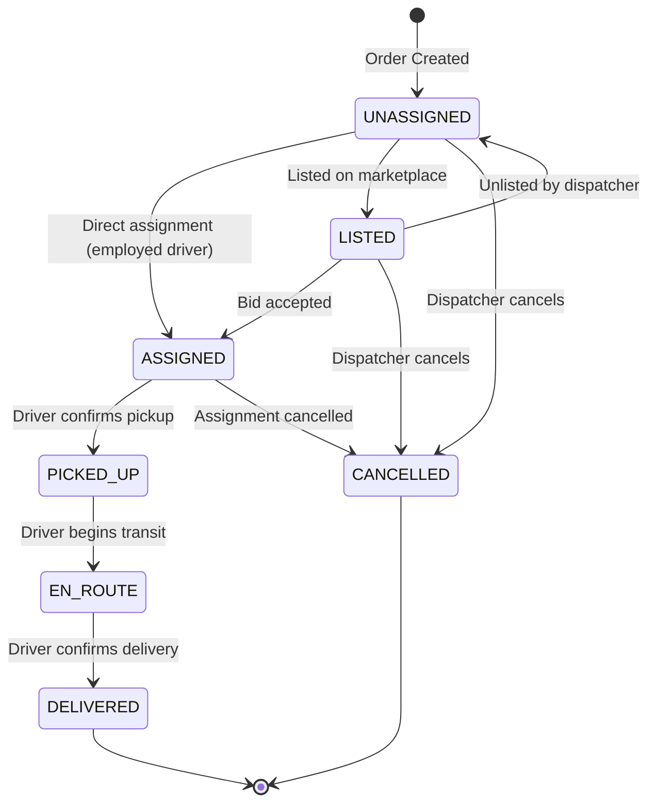
```mermaid
stateDiagram-v2
    [*] --> UNASSIGNED: Order Created

    UNASSIGNED --> ASSIGNED: Direct assignment (employed driver)
    UNASSIGNED --> LISTED: Listed on marketplace
    UNASSIGNED --> CANCELLED: Dispatcher cancels

    LISTED --> ASSIGNED: Bid accepted
    LISTED --> UNASSIGNED: Unlisted by dispatcher
    LISTED --> CANCELLED: Dispatcher cancels

    ASSIGNED --> PICKED_UP: Driver confirms pickup
    ASSIGNED --> CANCELLED: Assignment cancelled

    PICKED_UP --> EN_ROUTE: Driver begins transit
    EN_ROUTE --> DELIVERED: Driver confirms delivery

    DELIVERED --> [*]
    CANCELLED --> [*]
```

### 5.7 State Diagram — Driver Status

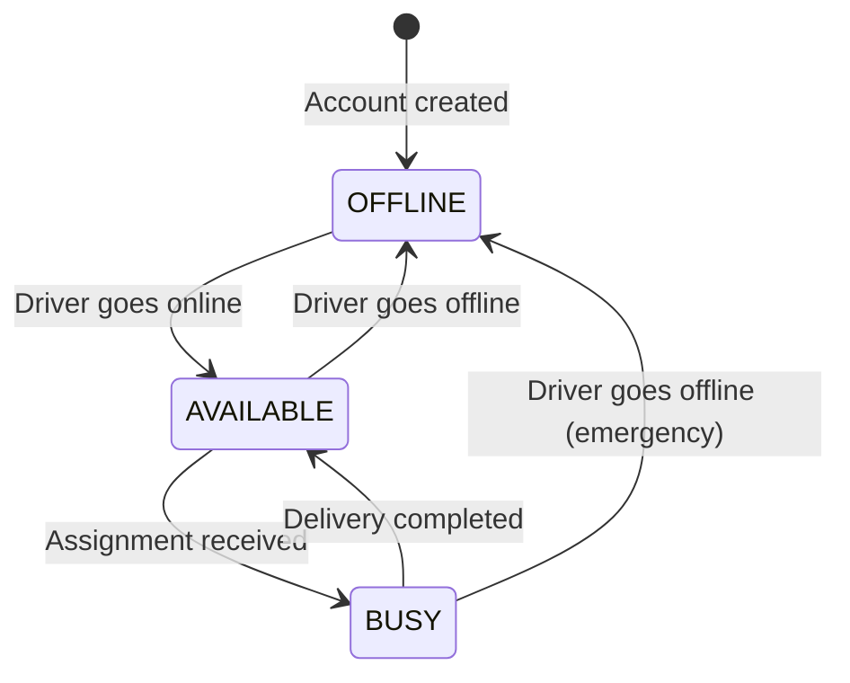
```mermaid
stateDiagram-v2
    [*] --> OFFLINE: Account created

    OFFLINE --> AVAILABLE: Driver goes online
    AVAILABLE --> BUSY: Assignment received
    BUSY --> AVAILABLE: Delivery completed
    AVAILABLE --> OFFLINE: Driver goes offline
    BUSY --> OFFLINE: Driver goes offline (emergency)
```

---

## 6. API Design

### 6.1 REST Endpoints

#### Authentication
| Method | Endpoint | Description | Auth |
|---|---|---|---|
| POST | `/api/auth/login` | Login with email/password | Public |
| POST | `/api/auth/refresh` | Rotate access token using refresh token | Public (refresh token required) |
| POST | `/api/auth/logout` | Clear auth cookies and client session | Authenticated |

#### Companies
| Method | Endpoint | Description | Auth |
|---|---|---|---|
| POST | `/api/companies` | Register a new company | Public (CE-02: Admin) |
| GET | `/api/companies` | List all companies | Tenant-scoped |
| GET | `/api/companies/:id` | Get company details | Tenant-scoped |
| PUT | `/api/companies/:id` | Update company settings | Tenant-scoped |

#### Orders
| Method | Endpoint | Description | Auth |
|---|---|---|---|
| POST | `/api/orders` | Create a new order | Dispatcher (tenant-scoped) |
| GET | `/api/orders` | List orders (company-scoped, supports `?for_driver=` filter) | Dispatcher / Driver (tenant-scoped) |
| GET | `/api/orders/:id` | Get order details | Dispatcher (tenant-scoped) |
| PUT | `/api/orders/:id/list` | List order on marketplace | Dispatcher (tenant-scoped) |
| PUT | `/api/orders/:id/unlist` | Remove from marketplace | Dispatcher (tenant-scoped) |
| POST | `/api/orders/:id/assign` | Direct assign to employed driver | Dispatcher (tenant-scoped) |
| GET | `/api/orders/:id/bids` | Get all bids for an order | Dispatcher (tenant-scoped) |
| PATCH | `/api/orders/:id/status` | Update order status (driver action) | Driver (tenant-scoped) |

#### Bids
| Method | Endpoint | Description | Auth |
|---|---|---|---|
| POST | `/api/bids` | Place a bid on a listed order | Independent Driver |
| PUT | `/api/bids/:id/accept` | Accept a bid | Dispatcher (tenant-scoped) |
| PUT | `/api/bids/:id/reject` | Reject a bid | Dispatcher (tenant-scoped) |

#### Drivers
| Method | Endpoint | Description | Auth |
|---|---|---|---|
| POST | `/api/drivers/signup` | Register as independent driver | Public |
| GET | `/api/drivers` | List drivers (company-scoped) | Dispatcher (tenant-scoped) |
| POST | `/api/drivers` | Create an employed driver | Dispatcher (tenant-scoped) |
| GET | `/api/drivers/:id` | Driver profile details | Dispatcher / Driver |
| PUT | `/api/drivers/:id` | Update driver profile/settings | Driver |
| PUT | `/api/drivers/:id/password` | Update driver password | Driver |
| PUT | `/api/drivers/:id/vehicle` | Create/update driver's vehicle | Driver |
| PUT | `/api/drivers/:id/verify` | Approve/reject independent driver | Admin |
| PATCH | `/api/drivers/:id/status` | Update driver online/offline status | Driver |
| POST | `/api/drivers/routes` | Pre-register a travel route | Independent Driver |
| GET | `/api/drivers/routes/mine` | Get driver's own routes | Independent Driver |
| GET | `/api/drivers/routes/active` | Get all active routes (for dispatchers) | Dispatcher |
| GET | `/api/drivers/routes/nearby` | Find drivers near a delivery path | Dispatcher |
| DELETE | `/api/drivers/routes/:routeId` | Deactivate a route | Independent Driver |

#### Location & Tracking
| Method | Endpoint | Description | Auth |
|---|---|---|---|
| POST | `/api/location/ping` | Submit GPS coordinates (rate limited) | Driver |
| GET | `/api/location/drivers` | Get latest location for all company drivers | Dispatcher |
| GET | `/api/location/track/:trackingCode` | Public tracking data | None (public) |

#### Dashboard
| Method | Endpoint | Description | Auth |
|---|---|---|---|
| GET | `/api/dashboard/stats` | Company-scoped order stats aggregation | Dispatcher (tenant-scoped) |
| GET | `/api/dashboard/user` | Current company profile info | Dispatcher (tenant-scoped) |
| GET | `/api/dashboard/marketplace-listings` | All LISTED orders (cross-tenant) | Independent Driver |
| GET | `/api/dashboard/driver-stats` | Aggregated driver stats (active, completed, rating) | Driver |
| GET | `/api/dashboard/driver-bids` | All bids placed by a driver with order details | Independent Driver |

#### Delivery History
| Method | Endpoint | Description | Auth |
|---|---|---|---|
| GET | `/api/history` | Get delivery history (role-scoped projection) | Dispatcher / Driver |
| GET | `/api/history/:assignmentId` | Get single delivery details (role-scoped) | Dispatcher / Driver |

#### Messages
| Method | Endpoint | Description | Auth |
|---|---|---|---|
| GET | `/api/messages/conversations` | List conversations (role-filtered, `?bucket=active\|archived`; recipient access requires `tracking_code`) | Dispatcher / Driver / Recipient |
| GET | `/api/messages/:orderId/:channel` | Get messages for an order channel | Dispatcher / Driver / Recipient |
| POST | `/api/messages/:orderId/:channel` | Send a message | Dispatcher / Driver / Recipient |
| PUT | `/api/messages/:orderId/:channel/read` | Mark messages as read | Dispatcher / Driver / Recipient |

#### SuperAdmin
| Method | Endpoint | Description | Auth |
|---|---|---|---|
| GET | `/api/superadmin/stats` | Platform-wide KPIs | SuperAdmin |
| GET | `/api/superadmin/companies` | All companies with counts | SuperAdmin |
| GET | `/api/superadmin/drivers` | All drivers across platform | SuperAdmin |
| GET | `/api/superadmin/orders` | All orders across platform | SuperAdmin |
| GET | `/api/superadmin/settings` | SuperAdmin preferences | SuperAdmin |
| PUT | `/api/superadmin/settings` | Update SuperAdmin preferences | SuperAdmin |

#### Health
| Method | Endpoint | Description | Auth |
|---|---|---|---|
| GET | `/api/health` | Health check with DB status | None |

### 6.2 Delivery History — Role-Based Field Projection

The same `/api/history` endpoint returns different fields based on the caller's role:

| Field | Dispatcher | Employed Driver | Independent Driver |
|---|---|---|---|
| Order ID | Yes | Yes | Yes |
| Tracking Code | Yes | Yes | Yes |
| Pickup Address | Yes | Yes | Yes |
| Delivery Address | Yes | Yes | Yes |
| Recipient Name/Phone/Email | Yes | Yes | Yes |
| Listed Price | Yes | No | Yes (for earnings) |
| Accepted Bid Price | Yes (via bids) | No | Yes (via bids) |
| Weight | Yes | No | Yes |
| Priority | Yes | No | Yes |
| Notes | Yes | No | Yes |
| Driver Name | Yes | N/A (own record) | N/A (own record) |
| Vehicle Info | Yes | Yes | No |
| Company Name | Yes | No | Yes |
| All Delivery Events | Yes | Yes (own) | Yes (own) |
| Timestamps | Yes | Yes | Yes |

### 6.3 WebSocket Events

| Event | Direction | Room | Payload |
|---|---|---|---|
| `location:ping` | Client → Server | — | `{driverId, lat, lng, speed, heading}` |
| `driver:location` | Server → Client | `company:{id}:dispatchers` | `{driverId, lat, lng, speed}` |
| `order:listed` | Server → Client | `company:{id}:marketplace` | `{orderId, price, pickup, delivery}` |
| `bid:new` | Server → Client | `company:{id}:marketplace` | `{bidId, orderId, driverId, price}` |
| `bid:accepted` | Server → Client | `driver:{id}` | `{bidId, orderId, assignment}` |
| `bid:rejected` | Server → Client | `driver:{id}` | `{bidId, orderId}` |
| `assignment:created` | Server → Client | `company:{id}:dispatchers` | `{assignmentId, orderId, driverId}` |
| `assignment:new` | Server → Client | `driver:{id}` | `{assignment, order details}` |
| `order:status` | Server → Client | `order:{id}:tracking` | `{orderId, status, timestamp}` |
| `driver:tracking` | Server → Client | `order:{id}:tracking` | `{lat, lng, estimatedArrival}` |
| `message:new` | Server → Client | `order:{id}:chat:{channel}` | `{message object}` |
| `join:company` | Client → Server | — | `{companyId}` |
| `join:marketplace` | Client → Server | — | `{companyId}` |
| `join:driver` | Client → Server | — | `{driverId}` |
| `join:tracking` | Client → Server | — | `{orderId}` |
| `join:messages` | Client → Server | — | `{orderId, channel}` |
| `leave:room` | Client → Server | — | `{room}` |

---

## 7. Scalability, Performance & Security

### 7.1 Security Measures

| Layer | Measure | Implementation |
|---|---|---|
| Transport | HTTPS/TLS | SSL certificates |
| Authentication | JWT access + refresh tokens (cookie-first) | HttpOnly cookies, bearer fallback in `Authorization` |
| Authorization | Tenant middleware | Every request verified against company_id |
| Input | Validation & sanitization | Express-validator on all endpoints |
| Database | Parameterized queries | Sequelize ORM (prevents SQL injection) |
| Rate Limiting | Per-IP and per-endpoint limits | Express-rate-limit (100/15min API, 20/min GPS) |
| Security Headers | Helmet.js | XSS, clickjack, MIME-sniff protection |
| WebSocket | Identity-based room joining | Room membership via socket events |

### 7.2 Performance Optimizations

| Optimization | Where | Impact |
|---|---|---|
| GPS ping debouncing | Client-side (useGeolocationPing hook) | Reduces write volume |
| Composite indexes | MySQL | Sub-10ms query times on filtered lookups |
| Connection pooling | Sequelize (min: 2, max: 10) | Reuse DB connections under load |
| WebSocket rooms | Socket.io | Only send data to relevant clients |
| Auto-refresh polling | Driver dashboards (30s interval) | Keeps data in sync without manual refresh |
| Pessimistic locking | Assignment Service (SERIALIZABLE) | Zero double-assignments |

---

## 8. Deployment & Maintenance

### 8.1 Deployment Architecture

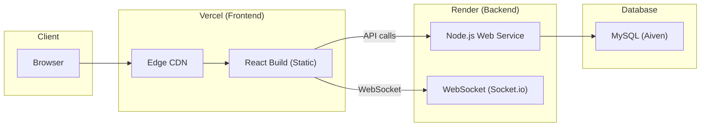
```mermaid
graph LR
    subgraph Client
        B["Browser"]
    end

    subgraph Vercel["Vercel (Frontend)"]
        CDN["Edge CDN"]
        REACT["React Build (Static)"]
    end

    subgraph Render["Render (Backend)"]
        APP["Node.js Web Service"]
        WSS["WebSocket (Socket.io)"]
    end

    subgraph Database
        MY["MySQL (Aiven)"]
    end

    B --> CDN --> REACT
    REACT -->|"API calls"| APP
    REACT -->|"WebSocket"| WSS
    APP --> MY
```

### 8.2 Monitoring & Logging

| Tool | Purpose | Status |
|---|---|---|
| Morgan | HTTP request logging | ✅ Implemented |
| Winston | Structured application logging | ✅ Implemented |
| Prometheus + Grafana | Metrics dashboard | 🔮 CE-02 |
| Sentry | Error tracking | 🔮 CE-02 |

---

## Technology Stack Summary

| Component | Technology | Version | Purpose |
|---|---|---|---|
| Frontend | React + Vite | React 19, Vite 7 | UI layer |
| Language | TypeScript | 5.9 | Type-safe frontend code |
| Styling | Tailwind CSS | v4 | Utility-first CSS framework |
| Animations | Framer Motion | 12.x | Page transitions and micro-animations |
| Icons | Lucide React | 0.575 | Icon system |
| UI Primitives | Radix UI | 1.x | Accessible component primitives |
| Maps | MapLibre GL JS + react-map-gl | MapLibre 5.19, react-map-gl 8.1 | WebGL-powered real-time fleet tracking |
| Routing | React Router DOM | v7 | Client-side routing |
| Real-Time (Client) | Socket.io Client | 4.8 | WebSocket communication |
| Backend | Node.js + Express | Express 4.22 | API and business logic |
| Real-Time (Server) | Socket.io | 4.8 | WebSocket rooms and events |
| ORM | Sequelize | 6.37 | Database abstraction and migrations |
| Database | MySQL | via mysql2 3.18 | Relational data with ACID transactions |
| Validation | Express-Validator + Joi | — | Request validation + env validation |
| Security | Helmet | 8.1 | HTTP security headers |
| Logging | Winston + Morgan | — | Structured logging |
| Frontend Deploy | Vercel | — | Edge CDN, instant deploys |
| Backend Deploy | Render | — | WebSocket support, managed services |
