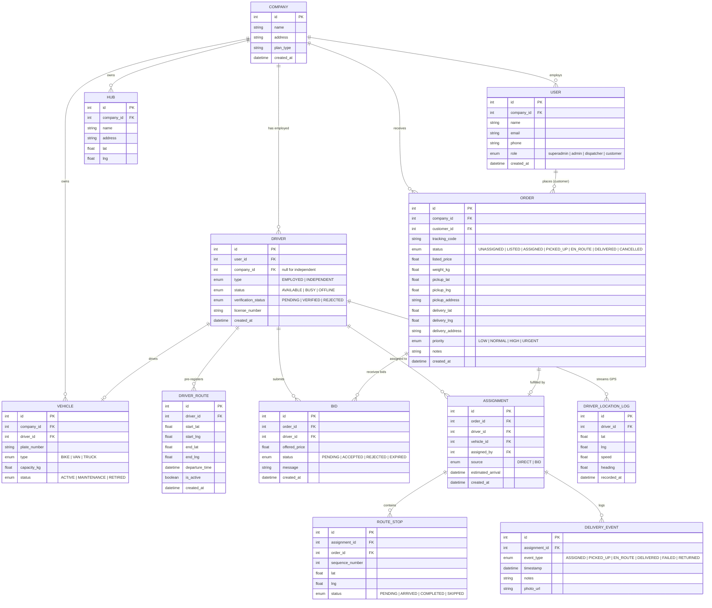

# dispatchCore — Complete System Design

> A real-time, multi-tenant last-mile logistics platform with an integrated gig-driver marketplace.

---

## Table of Contents
1. [Requirements & Scope](#1-requirements--scope)
2. [High-Level Design (HLD)](#2-high-level-design-hld)
3. [Database Design](#3-database-design)
4. [Low-Level Design (LLD)](#4-low-level-design-lld)
5. [UML Diagrams](#5-uml-diagrams)
6. [API Design](#6-api-design)
7. [Scalability, Performance & Security](#7-scalability-performance--security)
8. [Deployment & Maintenance](#8-deployment--maintenance)

---

## 1. Requirements & Scope

### 1.1 Problem Statement
Last-mile delivery is the most expensive segment of the logistics chain. Small and mid-sized courier companies lack real-time coordination tools, leading to double-assignments, idle drivers, zero customer visibility, and wasted fuel. dispatchCore solves this by providing a centralized, real-time dispatch control platform.

### 1.2 Functional Requirements

#### SuperAdmin
| ID | Requirement |
|---|---|
| FR-SA-01 | View and manage all companies on the platform |
| FR-SA-02 | View platform-wide KPIs (total deliveries, active drivers, revenue) |
| FR-SA-03 | Approve or suspend companies |
| FR-SA-04 | Resolve cross-company disputes |

#### Admin (Company-Level)
| ID | Requirement |
|---|---|
| FR-AD-01 | Manage company profile and settings |
| FR-AD-02 | Approve or reject independent driver verification requests |
| FR-AD-03 | Add/remove employed drivers and dispatchers |
| FR-AD-04 | View company-level analytics |

#### Dispatcher
| ID | Requirement |
|---|---|
| FR-D-01 | Create new delivery orders with pickup/dropoff coordinates |
| FR-D-02 | Assign orders directly to employed drivers (with concurrency safety) |
| FR-D-03 | List orders on the public marketplace with a listed price |
| FR-D-04 | View and accept/reject bids from independent drivers |
| FR-D-05 | View live map showing all employed drivers and active independent drivers |
| FR-D-06 | View real-time order status updates |
| FR-D-07 | View route-matched independent drivers near an order's path |
| FR-D-08 | View full delivery history (all fields: customer, pricing, events, driver info) |

#### Employed Driver
| ID | Requirement |
|---|---|
| FR-ED-01 | Receive assigned deliveries in real-time |
| FR-ED-02 | Update delivery status (PICKED_UP → EN_ROUTE → DELIVERED) |
| FR-ED-03 | Stream GPS location continuously while online |
| FR-ED-04 | View assigned delivery queue and route map |
| FR-ED-05 | View own delivery history (limited fields: pickup/dropoff, status, timestamps) |

#### Independent Driver
| ID | Requirement |
|---|---|
| FR-ID-01 | Register and submit verification documents |
| FR-ID-02 | Browse marketplace listings from all companies |
| FR-ID-03 | Place counter-offer bids on listed orders |
| FR-ID-04 | Pre-register travel routes (start, destination, departure time) |
| FR-ID-05 | Stream GPS only during active delivery |
| FR-ID-06 | Update delivery status once a bid is accepted |
| FR-ID-07 | View own delivery history (limited fields: pickup/dropoff, earnings, timestamps) |

#### Customer
| ID | Requirement |
|---|---|
| FR-C-01 | Track delivery live via a public link (no login required) |
| FR-C-02 | View order status timeline |
| FR-C-03 | See a live map pin of the driver's current location |

### 1.3 Non-Functional Requirements

| Category | Requirement | Target |
|---|---|---|
| **Latency** | GPS location updates | < 500ms end-to-end |
| **Latency** | Bid notifications to dispatcher | < 300ms |
| **Availability** | System uptime | 99.9% |
| **Concurrency** | Simultaneous order assignments | Zero double-assignments (ACID guarantee) |
| **Scalability** | Concurrent WebSocket connections | 10,000+ per server |
| **Scalability** | GPS pings per second | 1,000+ writes/sec |
| **Security** | Data isolation | Strict tenant boundary (company_id scoping) |
| **Security** | Authentication | JWT tokens with role-based access (CE-02) |
| **Performance** | GraphQL dashboard query | < 200ms with DataLoader |

### 1.4 MoSCoW Prioritization

| Priority | Features |
|---|---|
| **Must Have** | Multi-tenant isolation, Order CRUD, Direct assignment with locking, Live GPS tracking, WebSocket rooms, Marketplace listing, Bidding, Customer tracking page, Delivery history (role-scoped) |
| **Should Have** | Route pre-registration, Route matching, GraphQL analytics, Bid counter-offers, Delivery event audit log |
| **Could Have** | Driver leaderboard, Company-level analytics charts, Dark mode toggle |
| **Won't Have (CE-01)** | JWT auth, Push notifications, AI route optimization, Email notifications, CI/CD |

---

## 2. High-Level Design (HLD)

### 2.1 System Architecture


### 2.2 Data Flow Diagram (Level 0 - Context)


### 2.3 Data Flow Diagram (Level 1 - Processes)


### 2.4 Component Diagram


---

## 3. Database Design

### 3.1 Entity Relationship Diagram



### 3.2 Indexing Strategy

| Table | Index | Type | Purpose |
|---|---|---|---|
| `orders` | `company_id, status` | Composite | Fast filtered queries per tenant |
| `orders` | `tracking_code` | Unique | Customer tracking lookup |
| `bids` | `order_id, status` | Composite | Fetch pending bids for an order |
| `driver_location_logs` | `driver_id, recorded_at` | Composite | Time-series GPS queries |
| `driver_routes` | `is_active, departure_time` | Composite | Active route matching |
| `assignments` | `driver_id, created_at` | Composite | Driver assignment history |
| `delivery_events` | `assignment_id` | Foreign Key | Audit trail lookup |

### 3.3 Partitioning Strategy (Future)

| Table | Strategy | Reason |
|---|---|---|
| `driver_location_logs` | Time-based partitioning (monthly) | High write volume, old data rarely queried |
| `delivery_events` | Time-based partitioning (quarterly) | Audit log grows indefinitely |
| `orders` | None (CE-01) | Moderate volume, needs full query flexibility |

---

## 4. Low-Level Design (LLD)

### 4.1 Class Diagram


### 4.2 Error Handling Strategy

| Error Type | HTTP Code | Handling |
|---|---|---|
| Validation Error | 400 | Return field-specific error messages |
| Tenant Access Denied | 403 | Log attempt, return generic "Forbidden" |
| Resource Not Found | 404 | Return entity type and ID |
| Concurrency Conflict | 409 | Return "Order already assigned" message |
| Lock Timeout | 408 | Retry once, then return "Try again" |
| Internal Server Error | 500 | Log full stack trace, return generic message |

### 4.3 Input Validation Rules

| Entity | Field | Rules |
|---|---|---|
| Order | `pickup_lat/lng` | Required, valid coordinate range (-90 to 90, -180 to 180) |
| Order | `listed_price` | Required if listing, positive number, max 2 decimal places |
| Bid | `offered_price` | Required, positive, must differ from listed_price |
| GPS Ping | `lat/lng` | Required, valid coordinates |
| GPS Ping | `speed` | Optional, non-negative |
| DriverRoute | `departure_time` | Required, must be in the future |

---

## 5. UML Diagrams

### 5.1 Use Case Diagram


### 5.2 Sequence Diagram — Direct Assignment


### 5.3 Sequence Diagram — Marketplace Bidding


### 5.4 Sequence Diagram — GPS Location Broadcasting


### 5.5 Activity Diagram — Order Lifecycle


### 5.6 State Diagram — Order Status


### 5.7 State Diagram — Driver Status


---

## 6. API Design

### 6.1 REST Endpoints

#### Companies
| Method | Endpoint | Description | Auth |
|---|---|---|---|
| POST | `/api/companies` | Register a new company | SuperAdmin |
| GET | `/api/companies` | List all companies | SuperAdmin |
| GET | `/api/companies/:id` | Get company details | Admin |
| PUT | `/api/companies/:id` | Update company settings | Admin |

#### Orders
| Method | Endpoint | Description | Auth |
|---|---|---|---|
| POST | `/api/orders` | Create a new order | Dispatcher |
| GET | `/api/orders` | List orders (scoped by company) | Dispatcher |
| GET | `/api/orders/:id` | Get order details | Dispatcher |
| PUT | `/api/orders/:id/list` | List order on marketplace | Dispatcher |
| PUT | `/api/orders/:id/unlist` | Remove from marketplace | Dispatcher |
| POST | `/api/orders/:id/assign` | Direct assign to employed driver | Dispatcher |
| GET | `/api/orders/:id/bids` | Get all bids for an order | Dispatcher |

#### Bids
| Method | Endpoint | Description | Auth |
|---|---|---|---|
| POST | `/api/orders/:id/bid` | Place a bid | Independent Driver |
| PUT | `/api/bids/:id/accept` | Accept a bid | Dispatcher |
| PUT | `/api/bids/:id/reject` | Reject a bid | Dispatcher |

#### Drivers
| Method | Endpoint | Description | Auth |
|---|---|---|---|
| GET | `/api/drivers` | List drivers (company-scoped) | Dispatcher |
| GET | `/api/drivers/:id` | Driver profile details | Dispatcher / Driver |
| PUT | `/api/drivers/:id/verify` | Approve independent driver | Admin |
| POST | `/api/drivers/routes` | Pre-register a travel route | Independent Driver |
| GET | `/api/drivers/routes/nearby` | Find drivers near a path | Dispatcher |

#### Location & Tracking
| Method | Endpoint | Description | Auth |
|---|---|---|---|
| POST | `/api/location/ping` | Submit GPS coordinates | Driver |
| GET | `/api/track/:trackingCode` | Public tracking data | None (public) |

#### Delivery History
| Method | Endpoint | Description | Auth |
|---|---|---|
| GET | `/api/history` | Get delivery history (role-scoped projection) | Dispatcher / Driver |
| GET | `/api/history/:assignmentId` | Get single delivery details (role-scoped) | Dispatcher / Driver |

### 6.2 GraphQL Schema

```graphql
type Query {
  # Dispatcher Dashboard (uses DataLoader)
  dispatcherDashboard(companyId: ID!): DashboardData!
  
  # Marketplace
  marketplaceListings(filters: ListingFilters): [Order!]!
  orderBids(orderId: ID!): [Bid!]!
  
  # Route Matching
  availableRouteDrivers(pickupLat: Float!, pickupLng: Float!, deliveryLat: Float!, deliveryLng: Float!, radiusKm: Float): [Driver!]!
  
  # Analytics
  companyAnalytics(companyId: ID!, dateRange: DateRange): Analytics!
  driverLeaderboard(companyId: ID!, limit: Int): [DriverStats!]!
  
  # Delivery History (role-scoped)
  deliveryHistory(filters: HistoryFilters): [HistoryRecord!]!
}

type DashboardData {
  activeDrivers: [Driver!]!
  pendingOrders: [Order!]!
  activeAssignments: [Assignment!]!
  stats: DashboardStats!
}

type DashboardStats {
  totalDeliveriesToday: Int!
  avgDeliveryTime: Float!
  successRate: Float!
  activeDriverCount: Int!
}
```

### 6.3 Delivery History — Role-Based Field Projection

The same `deliveryHistory` endpoint returns different fields based on the caller's role:

| Field | Dispatcher | Employed Driver | Independent Driver |
|---|---|---|---|
| Order ID | Yes | Yes | Yes |
| Tracking Code | Yes | Yes | Yes |
| Pickup Address | Yes | Yes | Yes |
| Delivery Address | Yes | Yes | Yes |
| Customer Name | Yes | No | No |
| Customer Phone | Yes | No | No |
| Listed Price | Yes | No | Yes (their earnings) |
| Accepted Bid Price | Yes | No | Yes |
| Driver Name | Yes | N/A (own record) | N/A (own record) |
| Vehicle Info | Yes | Yes | No |
| All Delivery Events | Yes | Yes (own) | Yes (own) |
| Timestamps (created, delivered) | Yes | Yes | Yes |
| Priority | Yes | No | No |
| Notes | Yes | No | No |

### 6.4 WebSocket Events

| Event | Direction | Room | Payload |
|---|---|---|---|
| `location:update` | Client → Server | — | `{lat, lng, speed, heading}` |
| `driver:location` | Server → Client | `company:{id}:dispatchers` | `{driverId, lat, lng, speed}` |
| `order:listed` | Server → Client | `company:{id}:marketplace` | `{orderId, price, pickup, delivery}` |
| `bid:new` | Server → Client | `company:{id}:marketplace` | `{bidId, orderId, driverId, price}` |
| `bid:accepted` | Server → Client | `driver:{id}` | `{bidId, orderId, assignment}` |
| `bid:rejected` | Server → Client | `driver:{id}` | `{bidId, orderId}` |
| `assignment:created` | Server → Client | `company:{id}:dispatchers` | `{assignmentId, orderId, driverId}` |
| `assignment:new` | Server → Client | `driver:{id}` | `{assignment, order details}` |
| `order:status` | Server → Client | `order:{id}:tracking` | `{orderId, status, timestamp}` |
| `driver:tracking` | Server → Client | `order:{id}:tracking` | `{lat, lng, estimatedArrival}` |

---

## 7. Scalability, Performance & Security

### 7.1 Caching Strategy (CE-02)

| Data | Cache | TTL | Invalidation |
|---|---|---|---|
| Company settings | Redis | 1 hour | On update |
| Driver latest location | Redis | 10 seconds | On every GPS ping |
| Marketplace listings | Redis | 30 seconds | On list/unlist/accept |
| GraphQL dashboard | Application-level (DataLoader) | Per-request | Automatic |

### 7.2 Security Measures

| Layer | Measure | Implementation |
|---|---|---|
| Transport | HTTPS/TLS | SSL certificates |
| Authentication | JWT tokens (CE-02) | Role-encoded, company-scoped |
| Authorization | Tenant middleware | Every request verified against company_id |
| Input | Validation & sanitization | Express-validator on all endpoints |
| Database | Parameterized queries | Sequelize ORM (prevents SQL injection) |
| Rate Limiting | Per-IP and per-user limits | Express-rate-limit |
| WebSocket | Token-based handshake | Verify identity on connection |

### 7.3 Performance Optimizations

| Optimization | Where | Impact |
|---|---|---|
| DataLoader batching | GraphQL resolvers | Eliminates N+1 queries |
| GPS ping debouncing | Client-side | Reduces write volume by 60% |
| Composite indexes | MySQL | Sub-10ms query times on filtered lookups |
| Connection pooling | Sequelize | Reuse DB connections under load |
| WebSocket rooms | Socket.io | Only send data to relevant clients |

---

## 8. Deployment & Maintenance

### 8.1 Deployment Architecture (CE-02)


### 8.2 Monitoring & Logging

| Tool | Purpose | Phase |
|---|---|---|
| Morgan | HTTP request logging | CE-01 |
| Winston | Structured application logging | CE-01 |
| Prometheus + Grafana | Metrics dashboard | CE-02 |
| Sentry | Error tracking | CE-02 |

### 8.3 CI/CD Pipeline (CE-02)


---

## Technology Stack Summary

| Component | Technology | Purpose |
|---|---|---|
| Frontend | React + Vite | UI layer |
| Styling | CSS Custom Properties | Theme system (light/dark) |
| Maps | MapLibre GL JS + react-map-gl | WebGL-powered real-time fleet tracking |
| Tiles | MapTiler (free tier) / OpenFreeMap | Vector tile hosting |
| Backend | Node.js + Express | API and business logic |
| GraphQL | Apollo Server | Complex analytics queries |
| WebSockets | Socket.io | Real-time bidirectional events |
| ORM | Sequelize | Database abstraction and migrations |
| Database | MySQL | Relational data with ACID transactions |
| Cache | Redis (CE-02) | Session and location caching |
| Frontend Deploy | Vercel | Edge CDN, instant deploys, free tier |
| Backend Deploy | Render | WebSocket support, managed services, free tier |
